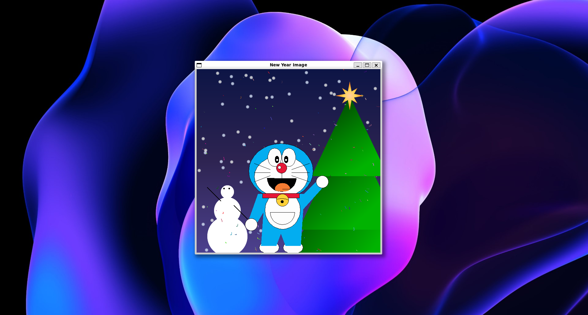

<div align="center">
    <h1><code>🎄⛄👸</code> New Year Image</h1>
    <strong>Drawing a new year image with Java (Swing)</strong>
    
</div>

## `📦` Prerequisites

- [Java](https://www.java.com/en/download/) (Used version: 21.0.1)
- [Gradle](https://gradle.org/install/) (Used version: 8.5)
- [Git](https://git-scm.com/downloads) (Used version: 2.43.0)

## `🚀` Usage

```bash
# Clone this repository
git clone https://github.com/Mephisto-Grumpy/NewYearDraw

# Go into the repository
cd NewYearDraw

# Run the application
gradle run # or
gradle runWithJavaExec
```

## 📝 License

This project is licensed under the MIT License. See the [LICENSE](LICENSE) file for details.
